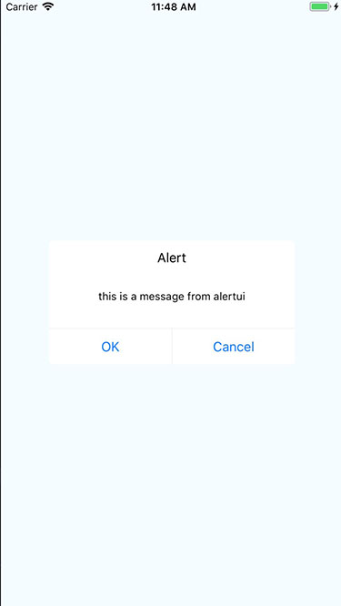

# react-native-alertui
if you want to have a same alert dialog ui on android and ios,you can use react-native-alertui,it provide a common component for both android and ios platform.
## previews

## example
```
cd example && npm install
```
## usage
```
npm install react-native-alertui --save
```
```javascript
import AlertUI from 'react-native-alertui'
```
now you can use AlertUI maybe with the code below.
```javascript react
<AlertUI 
    title = 'Alert'
    message = 'this is a message from alertui'
    buttons ={
        [
            {
                text:'OK',
                onPress:function(){/*dosth*/}
            },
            {
                text:'Cancel',
                onPress:function(){/*dosth*/}
            }
        ]}
/>
```